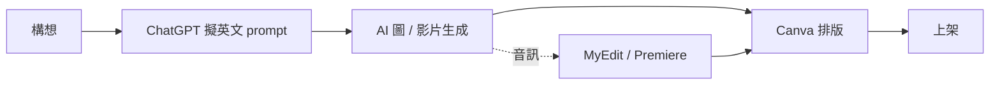

# 工具集

> 自媒體創作日常會用到的線上工具盤點 —— 從 AI 生成、設計排版、音訊處理，到檔案轉換。

> [!warning] 「有免費額度」不等於「可以免費產出成品」
> 這份清單多數工具有免費額度，但**免費方案的用途通常是試用，不是生產**。最常見的兩道牆：
>
> - **浮水印** —— 輸出帶品牌浮水印，等於不能對外發佈
> - **額度極少** —— 幾支影片或一次性點數就用完
>
> 下面凡是免費方案無法直接產出可發佈成品的，都標了 ⚠️。**規劃專案前先確認你要的輸出格式在哪個方案裡**，不要等做完才發現載不出來或洗不掉浮水印。
> （方案內容變動頻繁，以下為 2026-08 查證的狀況，請以官網當下為準。）

## 圖像生成（AI 繪圖）

> [!warning] 這一類工具汰換極快
> 下面幾個連結**目前都還能開**，但列出的 Stable Diffusion 3 / 3.5 是 **2024 年**的模型世代。如果你是現在才要開始，建議先看一下當下有哪些新選擇，不要把這份清單當成「最佳解」——它比較像「免費、不用註冊、可以馬上試」的入門管道。

1. [Stable Diffusion 3 Medium](https://huggingface.co/spaces/Nick088/Stable-Diffusion-3-Medium-SuperPrompt) —— Hugging Face 社群 demo（含 SuperPrompt 輔助），免費可試。
2. [Stable Diffusion 3.5 Large](https://huggingface.co/spaces/multimodalart/stable-diffusion-3.5-large-turboX) —— 較新版本，畫面細節與 prompt 理解度更好（社群 demo: turboX 變體，加速版）。
3. [Leonardo AI](https://leonardo.ai/) —— 介面友善、有預設模型可選，適合不想自己調模型的人。

> [!tip] 訣竅
> 選模板後、餵 prompt 之前，**先請 ChatGPT 幫你擬一段英文 prompt**，再丟進繪圖工具。AI 之間互相溝通比人腦想英文 prompt 快很多。

## 影片生成（AI 影片）

> [!caution] ⚠️ 這一類是清單裡最花錢的
> AI 影片生成的運算成本高，所以免費方案給得最緊。**下面兩個工具的免費輸出都帶浮水印**，實務上只能拿來評估效果，不能直接發佈。
> 想做出能上架的成品，這一類要有付費的心理準備。

1. ⚠️ [HeyGen](https://app.heygen.com/) —— 上傳影像或圖片，可改變聲音內容（例如中文轉英文配音）；圖片可變成會說話的動圖（Talking Photo）。
   - **免費方案**：每月 3 支、每支上限 1 分鐘、720p，且**每支輸出都有浮水印**，無法移除。
   - 定位是「試看看效果」，要對外發佈得升級到付費方案。
2. ⚠️ [Runway ML](https://app.runwayml.com/) —— 圖生圖、文生影片、圖生影片皆可。
   - **免費方案**：125 點額度（各家報導對是否會重置說法不一，以官網為準），**輸出同樣帶浮水印**。
   - **以圖生影片**（image to video）時，**在 prompt 中加入動作描述**，動作會更精準。
   - 單次生成的影片秒數有限。
   - 也能生成一系列圖片，是「圖生圖」的延伸應用。

> [!tip] 免費額度該花在哪
> 額度這麼少的時候，不要拿來「玩玩看」。**先想清楚你要驗證什麼**——是這個工具的嘴型準不準？換聲音自然嗎？某個運鏡做不做得到？帶著具體問題去用那三支影片，才問得出「值不值得付錢」。

## 設計

1. [Canva](https://www.canva.com/) —— 粉專封面、YouTube 縮圖、社群貼文等版面設計都有現成模板，**圖片尺寸已對應各平台規格**，省去查表時間。

## 音訊處理

1. [MyEdit](https://myedit.online/) —— 各種聲音處理（擷取人聲、去除人聲、變聲、降噪等），瀏覽器即可操作。
2. [pyTranscriber](https://pytranscriber.github.io/) —— 語音辨識（speech-to-text），免費、支援多語，仍在維護中。新版已內建 **OpenAI Whisper 本機處理**，所以「不把檔案上傳到雲端」這件事現在真的做得到（舊版走 Google Speech API，是要連網的）。
3. **Adobe Premiere Pro** —— 剪接時若要做語音辨識／自動上字幕，**強烈建議直接用 Premiere 內建**，整合度比第三方工具好。

## 檔案轉換

1. [CloudConvert](https://cloudconvert.com/) —— 多元格式轉檔（如 mkv → mp3），介面簡潔。
2. [Aconvert](https://www.aconvert.com/) —— 同類工具（如 mp4 → mp3），可作備援。
3. YouTube 影片／音檔下載工具（例如 vd6s 這類線上下載站）—— 下載音檔本質上等同於轉檔（取音軌）。**使用前請先看下面這段。**

> [!warning] 下載 YouTube 影片違反 YouTube 服務條款
> 這類第三方下載站雖然到處都是，但 **YouTube 服務條款明文禁止**在未經授權的情況下下載內容。這不只是「會不會被抓」的問題——如果你是自媒體創作者，**把來路不明的影片素材放進自己的作品，等於把版權風險接到自己身上**，被檢舉下架或收到版權聲明的是你的頻道。
>
> 合法取得素材的方式：
>
> - **自己的影片** → YouTube Studio 後台可以直接下載原始檔
> - **離線觀看** → YouTube Premium 的官方離線功能
> - **要拿別人的內容當素材** → 找**創用 CC 授權**的影片（YouTube 搜尋可用「篩選器 → 創用 CC」過濾），或直接向創作者取得授權
> - **免費素材庫** → YouTube 音效庫、各家 stock footage 的免費區
>
> 真的有下載需求時（例如備份自己的作品、或已取得授權的素材），也請確認你的用途站得住腳。**這篇不鼓勵、也不協助規避平台規則。**

## 工作流建議

把每段都當成一個獨立工具，**用最擅長那件事的工具做那件事**，不要試圖找一站式解決方案 —— 多數情況下「最強單點 × 5」會贏「萬能 × 1」。

---
