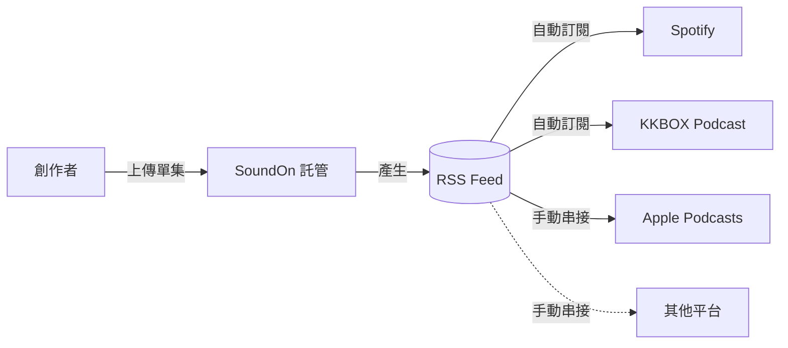

# 上架 Podcast

## 重新申請一個 Google 帳號

未免與自己本來的帳號相衝突，或社群操作時，影響到本來的帳號，建議申請一個新的 Google 帳號，每當使用新服務時，就利用此帳號登入。

## 透過 SoundOn、Firstory 等託管平台上架多平台，以 SoundOn 為例

> [!note] 關於 Anchor
> 早期的教學常提到 **Anchor** 這個免費託管服務。它已被 Spotify 收購並收掉品牌，功能併入 Spotify 自家的創作者後台（現名 **Spotify for Creators**）。
>
> 現在看到寫著「用 Anchor 上架」的文章，一律當成過時資料處理。台灣創作者常用的託管平台是 **SoundOn** 與 **Firstory**。

### 什麼是 RSS Feed?

1. RSS 是一種聚合內容，是 XML 檔，每當原內容改變時，訂閱內容的使用者便會接到內容更新通知。
2. 前段是說使用者透過訂閱 RSS，便可不斷獲取想閱讀、收聽、收看的內容而不讓平台恣意以演算法強推各種相關內容給你，若能如此，我們將不再需要**番茄時鐘**，專注在想看的內容上面。
3. 反過來，我們也可以使用**聚合內容**，來讓不同平台上架**相同**的你的創作，這點就在 Podcast 上架時體現。
4. 作法是透過 RSS Feed，這即是說使用 RSS Feed 上架 Podcast，只需要更新一次，不需要多平台複製貼上，而多平台發文的話，可以使用 [dlvr.it](https://dlvrit.com/) 這個工具網站，後面會有專文。

> 下面先來看看 RSS Feed 長得如何

> RSS 就跟 HTML、XML 非常相似，裡面使用的是**標籤式語言**，標籤式語言目的在於排列結構，方面檢視、安排以 **<>** 作為開頭，**</>** 作為結尾的標籤的內容。
>
> HTML 也是一種標籤式語言。

> 在 SoundOn 的管理後台，平台發佈頁籤可以看見 RSS 網址，這就是前段說的 RSS Feed，我們可以透過 SoundOn 裡的 RSS Feed 餵食給不同的平台，如 Spotify、Apple Podcast 等。

> [!info] 為什麼要走 RSS Feed？
> 一次更新（在 SoundOn 新增單集），全部訂閱該 Feed 的平台都會自動同步 —— 不必到 Spotify、Apple、KKBOX 各自上架一次。

---

### 使用

#### 建立新的 Podcast 節目

1. 進入 [SoundOn 網站](https://www.soundon.fm/)，下拉至**創作者看這裡**，點擊進去。

2. 就會到 [SoundOn For Podcastor](https://podcasters.soundon.fm/)，接著選馬上註冊，以不同目的來建立帳號。

> 第一次建立帳號的使用者就選擇**建立新節目**，將來任何單集的更新就從 SoundOn 來變更、增加就行了。
>
> 這即是說 SoundOn 是一個 Podcast 的**託管平台**，但它同時也是一個**收聽平台** (如 Spotify、Apple Podcast)，透過 SooundOn 產生的 RSS Feed，我們可以一次上架到不同平台。

3. 接著按下建立 Podcast，為你的節目上傳正方形的封面，設定名稱、語言等，好記短網址即是你**頻道的網址**，透過 SoundOn 的網址可以收聽你的節目。

> 建立 Podcast 就是建立節目，比方說**超級星期天**是一個週末的電視節目。
>
> 接著，你可以安排你的單集，他可以是一個單元，也可以是一個單元裡面的其中一集，比方說**超級任務** (卜學亮幫忙尋人的節目) 就是一個單元，尋找金城武的國小三年級導師，就是這個單元裡其中一集。
>
> 如果每一集都是一個單元，這個單集也叫做單元，好比 X 檔案裡，殺人蜂既是一個單集，也是一個單元，這個單元結束後就不再有跟殺人蜂相關的其他集。

4. 類別的部份，點下去就會有分類標籤選項，建立節目只要將左上有**紅色星號**的欄位都填完即可。而描述的部份就是你這個節目會有什麼樣的內容，簡單描述即可。

5. 版權宣告可以參照如下。

> [!example] 版權宣告範本
> 本頻道的所有內容，包括但不限於音頻、圖像、文本、設計、標誌及其他相關素材，均由頻道創建者 「」 共同擁有並保護。
>
> 將「」內換成該節目主創者的人名、暱稱、稱號等即可。

---

#### 建立新的 Podcast 單集

1. 接著在左邊**單集列表**頁籤，選擇右上角的新增單集。

2. 其實非常簡單，只要將剪輯好的音檔上傳，或從資料夾 / 桌面拖到該欄位就可以上傳了。

3. 標題就是這一集的名稱，描述即這一集的內容大綱。接著設定為一般單集即可，我們在此可以加入多個關鍵字，為了 SEO，方便大家找到你（僅限於 SoundOn 平台），每按一次 Enter（Return）為關鍵字的結尾，如此便可再設定下一個關鍵字。

4. 接著，上方頁籤選擇更多，就可以設定作者名稱，以及封面圖片，封面圖片預設為頻道的圖片，我們可以為單集上傳不同的圖片。

> 最後，按下右上角的儲存，這個單集的內容就會出現在你的 RSS Feed 中，並且等待一會兒，也會在 SoundOn 這個平台上架囉！

---

### 一同上架其他平台

#### Spotify

1. 在 SoundOn 中，我們從左邊點到平台發布頁籤。

2. 可以看到第一行的 RSS 網址，這個網址就是你的 RSS Feed 的網址，也就是之前說的 XML 檔案。當我們有了 RSS Feed，其他平台透過訂閱 RSS Feed，便可在你新增單集後，一併更新上去，這即是說，我們透過 RSS Feed 只要上架一次，在其中一個平台新增單集即可。

3. 而在 SoundOn 上，自動上架的平台有三個，SoundOn 本身、Spotify、KKBox Podcast，這三個平台並不一定需要申請帳號及建立頻道的過程，透過 SoundOn 的 RSS Feed 與該平台串接就可直接上架，不過如果你希望不同平台的描述內容有些微不同，那就沒有辦法分開調整了。

4. 我們點選 Spotify 下方的 **如何將節目提交上架 Spotify Podcast？** 的超連結。

5. 透過 [**連結**](https://podcasters.spotify.com) 進到這個頁面，這個頁面並不是平常你聽 Spotify 的網頁，而是專屬於 Podcaster 的網頁。

6. 由於我們沒有 Spotify Podcaster 帳號，點選下方的註冊 Spotify，接著使用 Google 帳號註冊。

7. 接著就是下一步下一步完成註冊，接下來的步驟相當重要，點擊**接受條款**。

8. [開始建立節目](https://creators.spotify.com/addpodcast) 在這個超連結中，我們可以看到建立新節目與**尋找現有節目**，由於在 SoundOn 我們已經建立了節目，所以必須要進到尋找現有節目選項。

9. 太棒了！在**RSS 動態連結**的地方填入剛才 SoundOn 中的 RSS Feed 網址。

> 最後按下右下角的繼續，等待剛才填入的 RSS Feed 與 Spotify 串接起來（會寄送驗證碼到你帳號的信箱中），你的 Podcast 頻道及所有單集就都在 Spotify 上了！

> 按下在頻道最上方的分享按鈕，我們可以直接把節目分享出去，或者一集一集分享出去，OK！上架 Spotify 完成了。
>
> 而其餘的步驟請看 SoundOn 的[說明頁](https://intercom.help/soundon/zh-TW/articles/4133015-%E5%A6%82%E4%BD%95%E5%B0%87%E7%AF%80-%E6%8F%90%E4%BA%A4%E4%B8%8A%E6%9E%B6-spotify-podcast)。

#### Apple Podcast

1. 在這個[網址](https://intercom.help/soundon/zh-TW/articles/4133012-%E5%A6%82%E4%BD%95%E5%B0%87%E7%AF%80-%E6%8F%90%E4%BA%A4%E4%B8%8A%E6%9E%B6-apple-podcast)中，主要是告訴我們要申請 Apple ID，有了 Apple ID 就可以使用 [Apple Podcasts Connect](https://podcastsconnect.apple.com/) 來建立你的 Podcast。

2. 假設大家都順利申請帳號並登入了，我們可以看到 Apple Podcasts Connect 最上方有個 Podcasts 按鈕。

3. 按下按鈕可見 New Channel 跟 New Show。

4. 在 Apple Podcasts Connet 上的結構是 Channel -> Show -> 單集，也就是先建立頻道，接著建立節目，最後是單集更新。

5. 在 Add New Show 的地方會問你要不要使用 RSS Feed 來建立，同樣地選擇要使用 RSS Feed 來建立。

6. 當你進到 RSS Feed URL 中，按下 Edit 按鈕，這個網址同樣是 SoundOn 幫你產生的 RSS 網址。

7. 當你將網頁拉到下方，我們可以看到 Apple Podcasts URL，按下 Copy 就可以將你的網址分享出去，或者在網站上找到你的節目了，OK！完成了！

---
